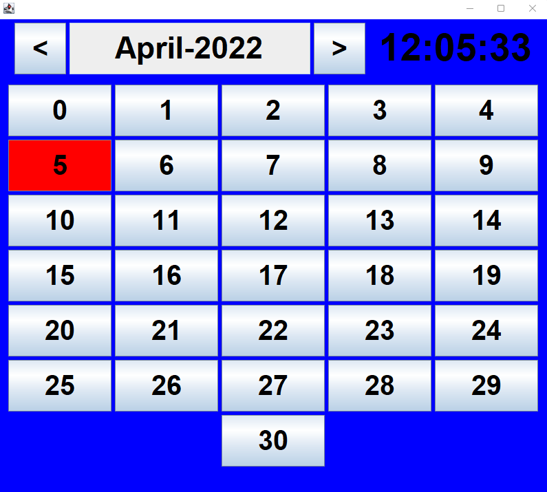

# Calendar
Der Kalendar ist einfach und übersichtlich gehalten. Er zeigt das heutige Datum und die Uhrzeit an und man kann zwischen verschiedensten Jahren umschalten, wobei der Kalendar für jedes Jahr die richtigen Anzahl Tage in den einzelnen Monaten anzeigt. Der Kalendar ist resizable und die Buttons wurden mit einem FlowLayout hinzugefügt, passen sich also dem Fenster an.



## Setup

1. Clone this repository
```
git clone https://github.com/github-gabriel/calendar.git
```

2. Navigate into the project directory
```
cd .\calendar\
```

3. Execute the .jar
```
java -jar .\Calender.jar
```
